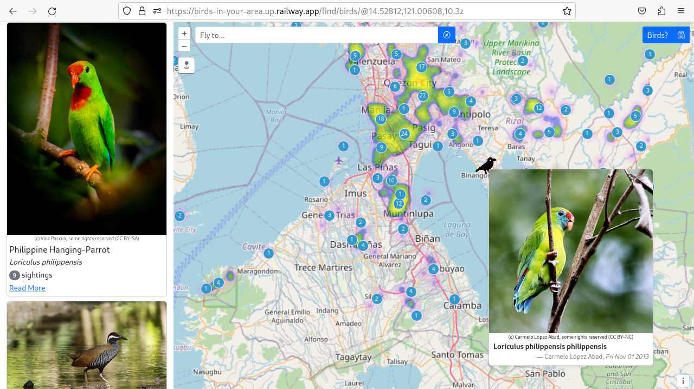

# birds-in-your-area
iNaturalist observation map for casual birders and critter enjoyers.



## Built With
* Django
* Bootstrap 5
* OpenLayers
* iNaturalist API
* Celery

## What's in here?
* extended Openlayers control class that integrates geolocation and device orientation 
* API call throttling via Celery & RabbitMQ 
* UTFGrid for lazy loading Vector Source in OpenLayers

## Setup
1. Clone the repo
```bash
git clone https://github.com/jmevangelist/birds-in-your-area.git
```

2. Create virtual environment and activate

```bash
cd birds-in-your-area
python3 -m venv /birdsInMyArea
source birdsInMyArea/bin/activate
```

3. Install python dependencies  

```bash
pip install -r requirements.txt 
```

4. Create SSL Certificate (optional)
```bash
certtool -p --key-type=rsa --bits=4096 --no-text --outfile=key.pem
certtool -s --load-privkey key.pem --no-text --outfile=cert.pem
```

5. Run
```bash
#For "prod" mode via Gunicorn
./run

# options
# --dev		dev mode
# --django 	run Django development server
```

6. (Optional-for throttling iNaturalist API calls) Run Celery & RabbitMQ
```bash
./runCelery
```


## Todo
- [x] Celery integration to throttle number of requests on iNat API
- [ ] Species filter
- [ ] Map Layers
- [ ] Celery as a service
- [ ] Species info page